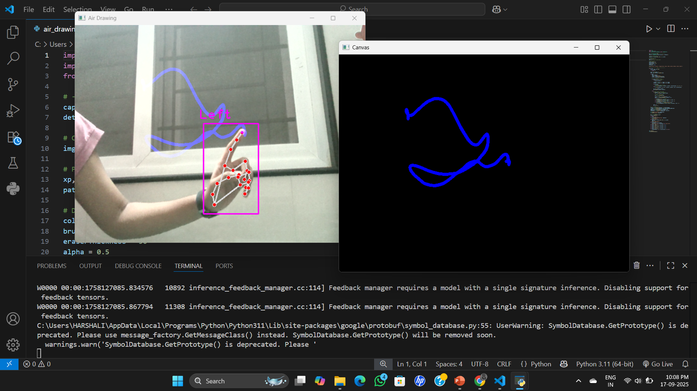
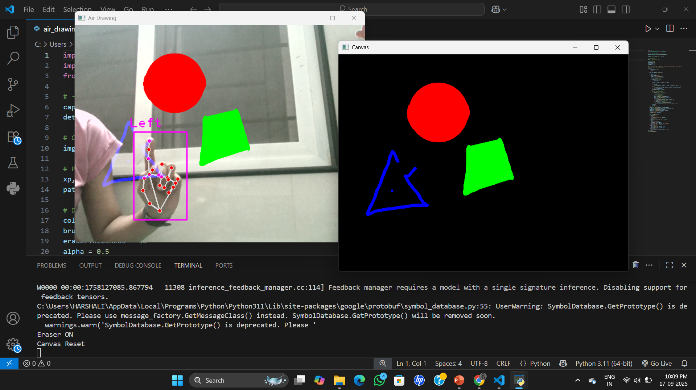
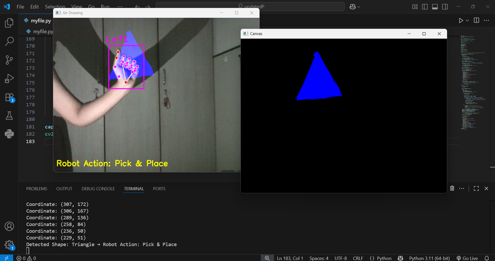
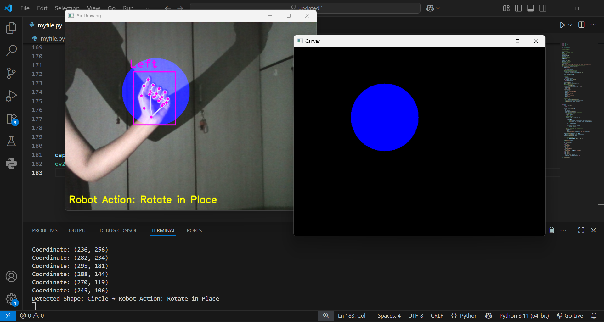

# ✍️ Air Drawing Project

## 📌 Overview

The Air Drawing project allows users to draw in the air using hand gestures. The system tracks hand movement through a camera and converts it into digital drawings in real time.

## 🎯 Objective

To create an interactive system that enables drawing without physical contact using computer vision techniques.

## 🛠️ Technologies Used

* Python
* OpenCV
* (Optional: MediaPipe for hand tracking)

## ⚙️ How It Works

* The webcam captures live video.
* Hand gestures are detected and tracked.
* The movement of fingers is converted into drawing strokes.
* The output is displayed on the screen in real time.

## 📂 Project Structure

* Source Code (Python files)
* Output Images
* README

## 📸 Output

## 🚀 Features

* Real-time air drawing
* Touch-free interaction
* Simple and intuitive interface

## 🔮 Future Improvements

* Add color selection using gestures
* Save drawings automatically
* Improve accuracy and tracking stability

## ⚠️ Note

This project is created for learning and demonstration purposes.
